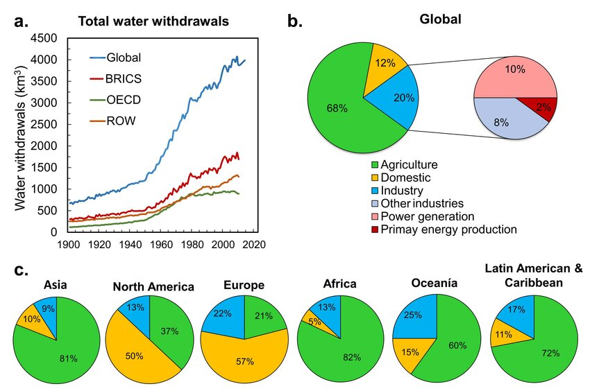

# 🌊 SuCount - Blockchain Water Management on Solana

**Transforming Agricultural Water Management through Blockchain Transparency**


> **One drop. One token. One blockchain.**

SuCount is a decentralized water quota management system built on Solana that tokenizes water resources, tracks consumption in real-time through IoT oracles, and incentivizes sustainable farming practices through NFT rewards.

---

## Submission to 2025 Solana Colosseum Submission by:

**Team Members:**
- **Zhaniya Baizhan** - [GitHub](https://github.com/mfhonley) | [Twitter](https://x.com/sadbutbot?s=21) | [LinkedIn](https://www.linkedin.com/in/zhaniya-b-745789365)
- **Igor Martynyuk** - [GitHub](https://github.com/IgorBlink) | [Twitter](https://x.com/IgorBlinkk) | [LinkedIn](https://www.linkedin.com/in/igor-martynyuk/)
- **Zhan Beissikeyev** - [GitHub](https://github.com/mfhonley) | [Twitter](https://x.com/mfhonley) | [LinkedIn](https://www.linkedin.com/in/mfhonley)
- **Sultan Karilov** - [GitHub](https://github.com/sulta24) | [Twitter](https://x.com/SKarilov48708) | [LinkedIn](https://www.linkedin.com/in/sultan-karilov-a9abb1362/)

---

## 🔗 Resources
 
| Resource | Link |
|----------|------|
| 🌐 **Live Application** | [https://sucount.site](https://sucount.site) |
| 📖 **API Documentation** | [https://api.sucount.site/docs](https://api.sucount.site/docs) |
| 🎥 **Demo Video** | [YouTube Link](#) |
| 📊 **Pitch Deck** | [Presentation Link](https://www.canva.com/design/DAG29vrS2JI/fML_vFLfrNLC7JfF7juSxg/view?utm_content=DAG29vrS2JI&utm_campaign=designshare&utm_medium=link2&utm_source=uniquelinks&utlId=h6f1e32c923) |
| 🔍 **Token on Explorer** | [View on Solana Explorer](https://explorer.solana.com/address/Dq53uysBgXgQYiMoBSBJJXDFYjq7DqBRTXumQhBr3n1u?cluster=devnet) |
| 💻 **Source Code** | [GitHub Repository](https://github.com/mfhonley/colosseum) |

---

## The Problem

### Global Water Crisis in Agriculture

Agriculture consumes **70% of global freshwater resources**, yet the sector faces critical challenges:

- **No Transparency**: Manual tracking, paper records, zero real-time visibility into water consumption
- **Inefficient Allocation**: Static quotas that don't adapt to actual usage patterns
- **No Incentives**: Farmers lack rewards for water conservation and efficiency
- **Economic Loss**: Over-allocation and waste lead to resource depletion and conflicts
  


**Impact:**
- 2.5 billion people face water scarcity
- 40-60% of agricultural water is wasted
- Farmers have no visibility into their consumption patterns
- According to the World Bank, global water losses amount to over $260 billion annually
- In Central Asia, up to 90 % of all freshwater is used for irrigation — yet 35–50 % of it is lost before reaching the fields
- Reducing these losses by just 10 % could save millions of dollars and preserve tens of thousands of hectares of land

---

## 💡 Our Solution

SuCount brings blockchain transparency to water management through three core innovations:

### 1. WaterCredits Token (SPL Token)

- **1 WC = 1 cubic meter** of water quota
- Fully fungible SPL token with 6 decimals
- **Deflationary model**: Tokens automatically burn on consumption
- Transferable between farmers (marketplace ready)

```
Token Mint: Dq53uysBgXgQYiMoBSBJJXDFYjq7DqBRTXumQhBr3n1u
Network: Solana Devnet
```

### 2. IoT Oracle Integration

- Real-time water consumption monitoring via IoT sensors
- Oracle service posts data on-chain **every 30 seconds**
- Automatic token burning based on actual usage
- Simulating 10 active farms with live data

### 3. NFT Certificates (Incentive System)

- Unique NFT rewards for farmers achieving >85% efficiency
- Supply = 1 (each certificate is unique)
- Proof of sustainable water management
- Tradeable and verifiable on-chain

---

## Key Features

### For Farmers
- Real-time water consumption dashboard
- On-chain balance tracking (WaterCredits)
- NFT certificate minting for efficiency
- Usage history and analytics
- Blockchain transaction verification

### For Water Providers
- Monitor all farms in one dashboard
- Mint monthly water quotas to farmers
- View consumption patterns and trends
- Identify over-users and efficient farmers
- Generate usage reports

### Technical Highlights
- **Real Solana Integration** - Not a simulation, actual blockchain transactions
- **Production Deployment** - Live on HTTPS with custom domain
- **Professional UI/UX** - Modern React dashboard with real-time updates
- **Complete API** - RESTful API with FastAPI
- **Docker Infrastructure** - Containerized services for easy deployment

---

## 🛠️ Tech Stack

### Blockchain
- **Solana Devnet** - Fast, low-cost blockchain
- **SPL Token Program** - WaterCredits token
- **Metaplex** - NFT certificates
- **Solana Web3.js / Python SDK** - Blockchain interaction

### Backend
- **FastAPI** (Python) - RESTful API
- **SQLite** - Local data storage
- **Solana Python SDK** - Blockchain integration
- **Poetry** - Dependency management

### Frontend
- **React** - UI framework
- **Vite** - Build tool
- **TailwindCSS** - Styling
- **Axios** - API communication

### Infrastructure
- **Docker & Docker Compose** - Containerization
- **Nginx** - Reverse proxy
- **Let's Encrypt** - SSL certificates
- **VPS Deployment** - Production hosting
  
---

## 🏗️ Architecture


---

## 🚀 Quick Start

### Prerequisites

- Docker & Docker Compose
- Node.js 20+ (for local development)
- Python 3.11+ (for local development)
- Solana CLI (optional, for testing)

### Installation

```bash
# 1. Clone repository
git clone https://github.com/mfhonley/colosseum.git
cd sucount

# 2. Configure backend environment
cat > back/.env << 'EOF'
SOLANA_NETWORK=devnet
SOLANA_RPC_URL=https://api.devnet.solana.com
SOLANA_AUTHORITY_KEY=your_base58_private_key
WATERCREDITS_MINT=Dq53uysBgXgQYiMoBSBJJXDFYjq7DqBRTXumQhBr3n1u

DATABASE_URL=sqlite:///./water_management.db
DEFAULT_WATER_LIMIT_LITERS=100000
WATER_CREDIT_RATE=1.0
DEBUG=True
EOF

# 3. Configure frontend environment
cat > front/.env << 'EOF'
VITE_API_URL=http://localhost:7483/api
EOF

# 4. Start all services
docker-compose up -d

# 5. Check status
docker-compose ps
docker-compose logs -f
```

### Create WaterCredits Token (First Time)

```bash
# Create token on Solana Devnet
curl -X POST http://localhost:7483/api/watercredits/create-token

# Response will include mint address
# Add it to back/.env: WATERCREDITS_MINT=<mint_address>

# Restart backend
docker-compose restart backend
```

---

## Program Information

### Deployed Contracts

| Contract | Address | Network |
|----------|---------|---------|
| **WaterCredits Token** | `Dq53uysBgXgQYiMoBSBJJXDFYjq7DqBRTXumQhBr3n1u` | Solana Devnet |
| **Token Program** | `TokenkegQfeZyiNwAJbNbGKPFXCWuBvf9Ss623VQ5DA` | Solana (SPL) |
| **Associated Token Program** | `ATokenGPvbdGVxr1b2hvZbsiqW5xWH25efTNsLJA8knL` | Solana (ATA) |

### Token Specifications

```json
{
  "name": "WaterCredits",
  "symbol": "WC",
  "decimals": 6,
  "supply_model": "deflationary",
  "mint_authority": "5DS8ak8SdJxcHJQBuQRj38MGxvMUPWv3wmx2L1n8pBPt",
  "use_case": "1 WC = 1 Liter water quota"
}
```


---

## 📸 Screenshots

### Landing Page


### Farmer Dashboard


### Provider Dashboard


### Blockchain Transaction


