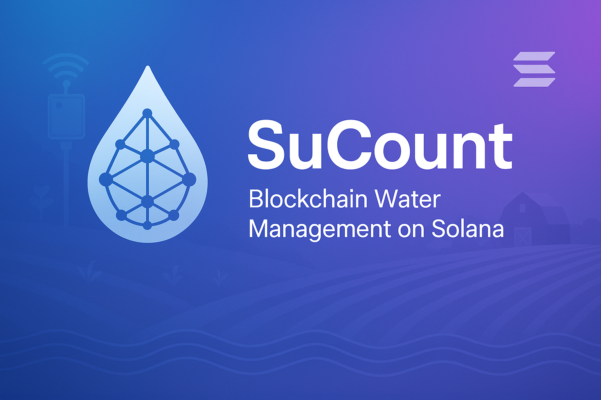
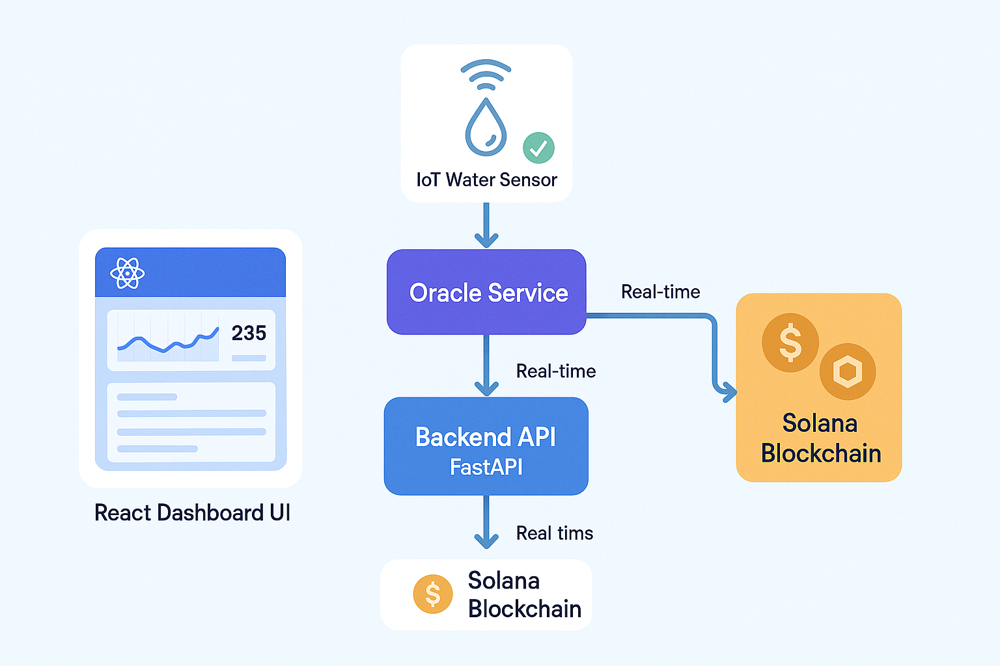
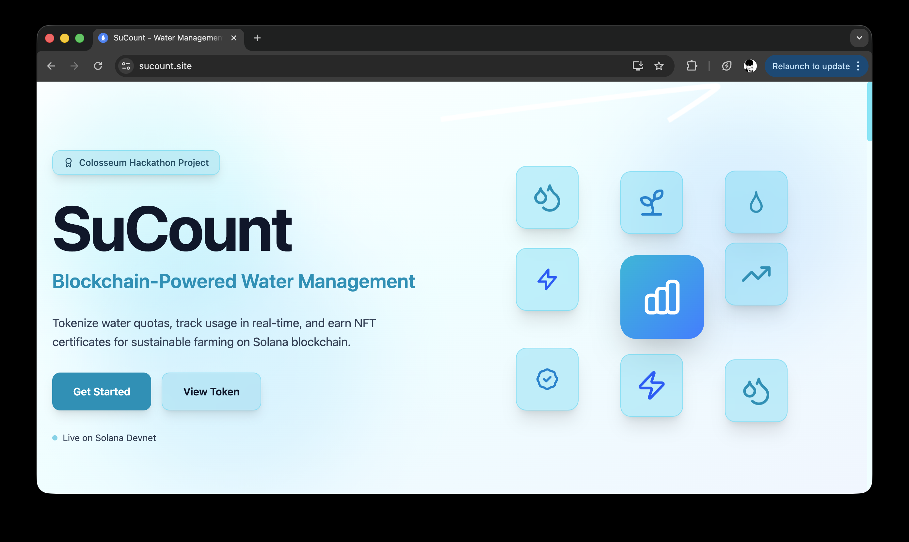
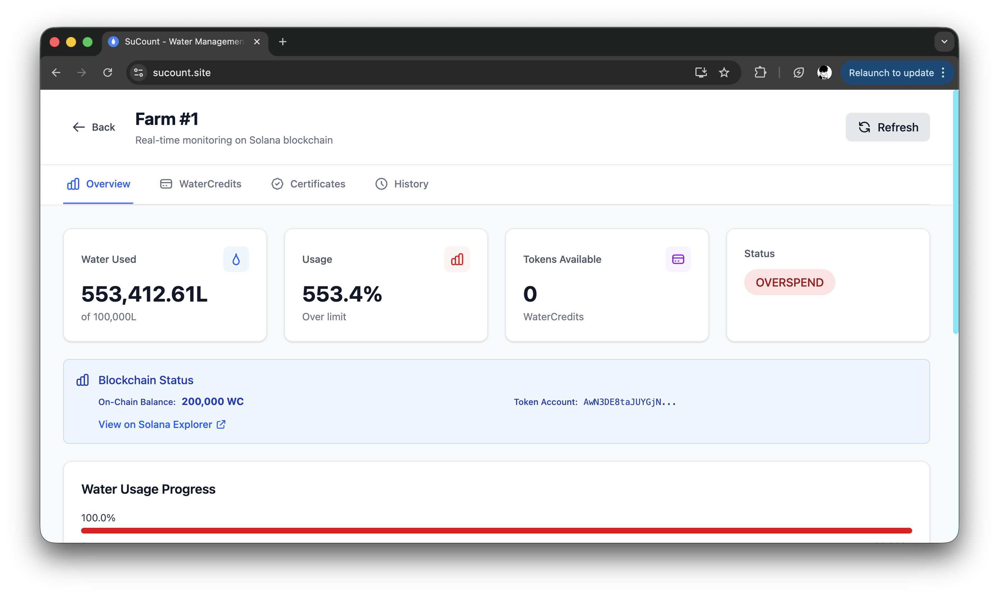
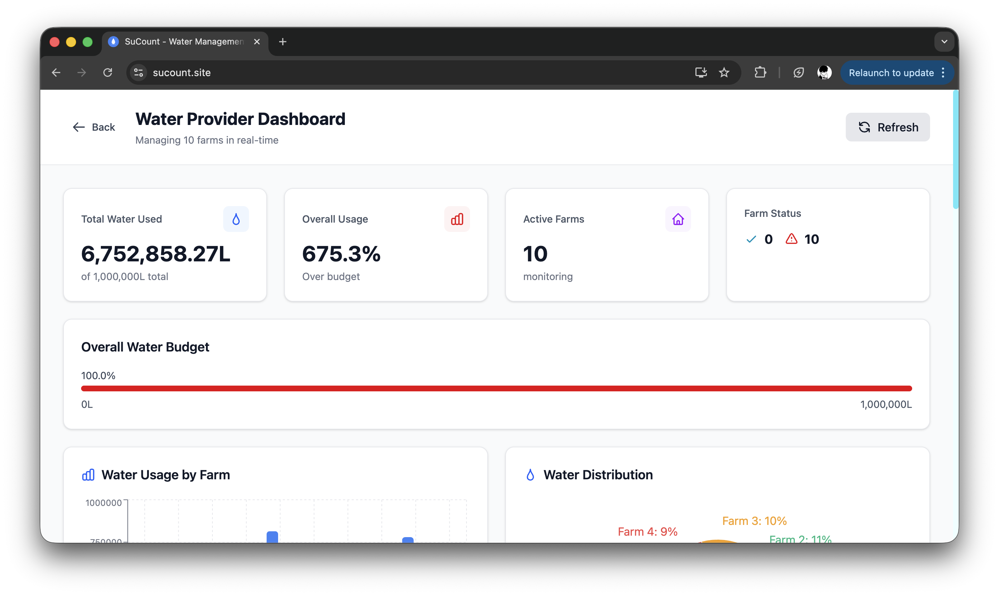
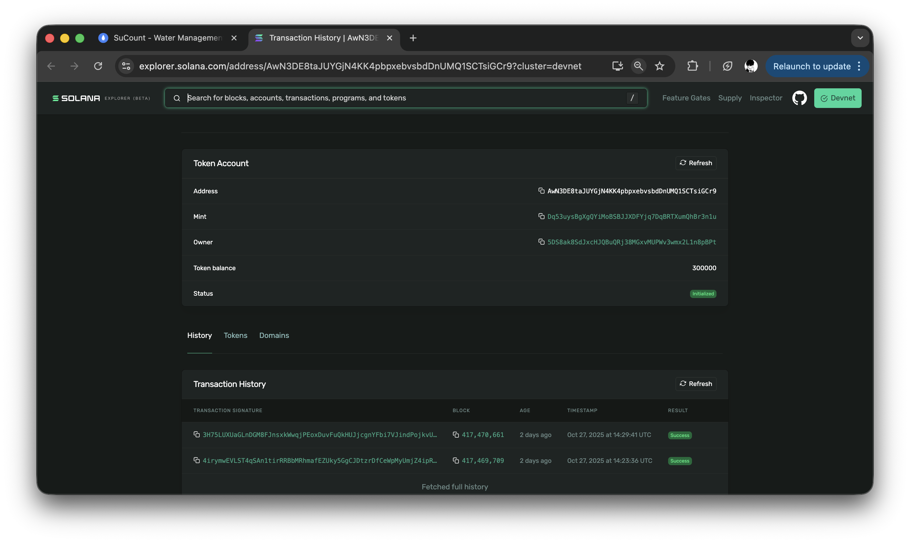

# SuCount - Blockchain Water Management on Solana

**Transforming Agricultural Water Management through Blockchain Transparency**



> **One drop. One token. One blockchain.**

SuCount is a decentralized water quota management system built on Solana that tokenizes water resources, tracks consumption in real-time through IoT oracles, and incentivizes sustainable farming practices through NFT rewards.

---

## 🏆 Submission by

**Team Members:**
- **Your Name** - [GitHub](https://github.com/mfhonley) | [Twitter](https://twitter.com/mfhonley) | [LinkedIn](https://linkedin.com/in/mfhonley)

---

## 🔗 Resources

| Resource | Link |
|----------|------|
| 🌐 **Live Application** | [https://sucount.site](https://sucount.site) |
| 📖 **API Documentation** | [https://api.sucount.site/docs](https://api.sucount.site/docs) |
| 🎥 **Demo Video** | [YouTube Link](#) |
| 📊 **Pitch Deck** | [Presentation Link](#) |
| 🔍 **Token on Explorer** | [View on Solana Explorer](https://explorer.solana.com/address/Dq53uysBgXgQYiMoBSBJJXDFYjq7DqBRTXumQhBr3n1u?cluster=devnet) |
| 💻 **Source Code** | [GitHub Repository](https://github.com/mfhonley/colosseum) |

---

## 🌊 The Problem

### Global Water Crisis in Agriculture

Agriculture consumes **70% of global freshwater resources**, yet the sector faces critical challenges:

- **🚨 No Transparency**: Manual tracking, paper records, zero real-time visibility into water consumption
- **📉 Inefficient Allocation**: Static quotas that don't adapt to actual usage patterns
- **❌ No Incentives**: Farmers lack rewards for water conservation and efficiency
- **💰 Economic Loss**: Over-allocation and waste lead to resource depletion and conflicts

**Impact:**
- 2.5 billion people face water scarcity
- 20-40% of agricultural water is wasted
- Farmers have no visibility into their consumption patterns

---

## ✨ Our Solution

SuCount brings blockchain transparency to water management through three core innovations:

### 1. 💧 WaterCredits Token (SPL Token)

- **1 WC = 1 Liter** of water quota
- Fully fungible SPL token with 6 decimals
- **Deflationary model**: Tokens automatically burn on consumption
- Transferable between farmers (marketplace ready)

```
Token Mint: Dq53uysBgXgQYiMoBSBJJXDFYjq7DqBRTXumQhBr3n1u
Network: Solana Devnet
```

### 2. 📡 IoT Oracle Integration

- Real-time water consumption monitoring via IoT sensors
- Oracle service posts data on-chain **every 30 seconds**
- Automatic token burning based on actual usage
- Simulating 10 active farms with live data

### 3. 🏆 NFT Certificates (Incentive System)

- Unique NFT rewards for farmers achieving >85% efficiency
- Supply = 1 (each certificate is unique)
- Proof of sustainable water management
- Tradeable and verifiable on-chain

---

## 🎯 Key Features

### For Farmers
- ✅ Real-time water consumption dashboard
- ✅ On-chain balance tracking (WaterCredits)
- ✅ NFT certificate minting for efficiency
- ✅ Usage history and analytics
- ✅ Blockchain transaction verification

### For Water Providers
- ✅ Monitor all farms in one dashboard
- ✅ Mint monthly water quotas to farmers
- ✅ View consumption patterns and trends
- ✅ Identify over-users and efficient farmers
- ✅ Generate usage reports

### Technical Highlights
- ✅ **Real Solana Integration** - Not a simulation, actual blockchain transactions
- ✅ **Production Deployment** - Live on HTTPS with custom domain
- ✅ **Professional UI/UX** - Modern React dashboard with real-time updates
- ✅ **Complete API** - RESTful API with FastAPI
- ✅ **Docker Infrastructure** - Containerized services for easy deployment

---

## 🏗️ Architecture



### System Flow

```
┌─────────────┐
│  IoT Sensor │ (Water meter on farm)
└──────┬──────┘
       │
       ↓ (consumption data)
┌──────────────┐
│ Oracle Service│ (Every 30 seconds)
└──────┬───────┘
       │
       ↓ (POST /api/water-usage)
┌────────────────┐
│  Backend API   │ (FastAPI)
│  - Record usage│
│  - Burn tokens │
└────────┬───────┘
         │
         ↓ (Solana transactions)
┌─────────────────┐
│  Solana Devnet  │
│  - WaterCredits │
│  - NFT Certs    │
└─────────────────┘
         ↑
         │ (Query balance)
┌─────────────────┐
│   React UI      │
│  - Farmer View  │
│  - Provider View│
└─────────────────┘
```

### User Journey

**Monthly Allocation:**
1. Provider mints 100,000 WC tokens to farmer
2. Farmer receives tokens in Solana wallet
3. All transactions visible on Solana Explorer

**Daily Usage:**
1. Farmer uses water for irrigation
2. IoT sensor measures consumption (e.g., 250 liters)
3. Oracle posts data to backend every 30 seconds
4. Backend burns 250 WC tokens from farmer's wallet
5. Balance updates in real-time on dashboard

**Monthly Rewards:**
1. End of month: system calculates efficiency score
2. If efficiency > 85%: mint unique NFT certificate
3. Farmer receives on-chain proof of sustainability

---

## 🛠️ Tech Stack

### Blockchain
- **Solana Devnet** - Fast, low-cost blockchain
- **SPL Token Program** - WaterCredits token
- **Metaplex** - NFT certificates
- **Solana Web3.js / Python SDK** - Blockchain interaction

### Backend
- **FastAPI** (Python) - RESTful API
- **SQLite** - Local data storage
- **Solana Python SDK** - Blockchain integration
- **Poetry** - Dependency management

### Frontend
- **React** - UI framework
- **Vite** - Build tool
- **TailwindCSS** - Styling
- **Axios** - API communication

### Infrastructure
- **Docker & Docker Compose** - Containerization
- **Nginx** - Reverse proxy
- **Let's Encrypt** - SSL certificates
- **VPS Deployment** - Production hosting

---

## 🚀 Quick Start

### Prerequisites

- Docker & Docker Compose
- Node.js 20+ (for local development)
- Python 3.11+ (for local development)
- Solana CLI (optional, for testing)

### Installation

```bash
# 1. Clone repository
git clone https://github.com/mfhonley/colosseum.git
cd sucount

# 2. Configure backend environment
cat > back/.env << 'EOF'
SOLANA_NETWORK=devnet
SOLANA_RPC_URL=https://api.devnet.solana.com
SOLANA_AUTHORITY_KEY=your_base58_private_key
WATERCREDITS_MINT=Dq53uysBgXgQYiMoBSBJJXDFYjq7DqBRTXumQhBr3n1u

DATABASE_URL=sqlite:///./water_management.db
DEFAULT_WATER_LIMIT_LITERS=100000
WATER_CREDIT_RATE=1.0
DEBUG=True
EOF

# 3. Configure frontend environment
cat > front/.env << 'EOF'
VITE_API_URL=http://localhost:7483/api
EOF

# 4. Start all services
docker-compose up -d

# 5. Check status
docker-compose ps
docker-compose logs -f
```

### Access the Application

- **Frontend**: http://localhost:8473
- **Backend API**: http://localhost:7483
- **API Docs**: http://localhost:7483/docs

### Create WaterCredits Token (First Time)

```bash
# Create token on Solana Devnet
curl -X POST http://localhost:7483/api/watercredits/create-token

# Response will include mint address
# Add it to back/.env: WATERCREDITS_MINT=<mint_address>

# Restart backend
docker-compose restart backend
```

---

## 🔐 Program Information

### Deployed Contracts

| Contract | Address | Network |
|----------|---------|---------|
| **WaterCredits Token** | `Dq53uysBgXgQYiMoBSBJJXDFYjq7DqBRTXumQhBr3n1u` | Solana Devnet |
| **Token Program** | `TokenkegQfeZyiNwAJbNbGKPFXCWuBvf9Ss623VQ5DA` | Solana (SPL) |
| **Associated Token Program** | `ATokenGPvbdGVxr1b2hvZbsiqW5xWH25efTNsLJA8knL` | Solana (ATA) |

### Token Specifications

```json
{
  "name": "WaterCredits",
  "symbol": "WC",
  "decimals": 6,
  "supply_model": "deflationary",
  "mint_authority": "5DS8ak8SdJxcHJQBuQRj38MGxvMUPWv3wmx2L1n8pBPt",
  "use_case": "1 WC = 1 Liter water quota"
}
```

---

## 📊 Live Demo Walkthrough

### 1. Farmer Dashboard

**Access:** https://sucount.site → Select "I'm a Farmer" → Choose Farm ID

**Features:**
- **Overview Tab**: Real-time stats, blockchain status, water usage
- **WaterCredits Tab**: Mint quota, check on-chain balance
- **NFT Certificates Tab**: Mint efficiency awards
- **History Tab**: Complete usage logs

**Demo Actions:**
```bash
# Mint 100,000 WC tokens to Farmer #1
curl -X POST "https://api.sucount.site/api/watercredits/mint-quota?farm_id=1&amount=100000"

# Check on-chain balance
curl "https://api.sucount.site/api/watercredits/balance/1"

# Mint NFT certificate (if efficiency > 85%)
curl -X POST "https://api.sucount.site/api/nft/mint?farm_id=1&water_consumed=5000&efficiency_score=0.95"
```

### 2. Provider Dashboard

**Access:** https://sucount.site → Select "I'm a Water Provider"

**Features:**
- Monitor all 10 farms simultaneously
- Bar chart: water consumption per farm
- Pie chart: distribution breakdown
- Usage table with efficiency scores
- Recent activity feed

### 3. Verify on Blockchain

All transactions are verifiable on Solana Explorer:

- **Token**: https://explorer.solana.com/address/Dq53uysBgXgQYiMoBSBJJXDFYjq7DqBRTXumQhBr3n1u?cluster=devnet
- **Transactions**: View mint, burn, transfer operations
- **NFT Certificates**: Each NFT has unique on-chain metadata

---

## 🌍 Impact & Scalability

### Real-World Impact

- **2.5 billion people** experience water scarcity globally
- **70% of freshwater** used by agriculture
- **20-40% efficiency gains** possible with proper monitoring
- **$200B+ market** for agricultural water management

### Scalability

- **Solana Capacity**: 65,000 TPS easily supports millions of farms
- **Oracle Efficiency**: 30-second intervals × batch processing
- **Low Transaction Costs**: ~$0.00025 per transaction on Solana
- **Global Deployment**: Works in any water-scarce region

### Next Steps

1. **Mainnet Deployment** - Move from Devnet to Solana Mainnet
2. **Real IoT Hardware** - Partner with LoRa/GSM sensor manufacturers
3. **Token Marketplace** - Enable farmers to trade water quotas
4. **DeFi Integration** - Collateral, lending, derivatives for WC tokens
5. **Geographic Expansion** - Pilot programs in water-scarce regions
6. **Carbon Credits** - Expand to other resource tokens (energy, carbon)

---

## 📸 Screenshots

### Landing Page


### Farmer Dashboard


### Provider Dashboard


### Blockchain Transaction


---

## 🧪 Testing

```bash
# Run backend tests
cd back
poetry install
poetry run pytest

# Test API endpoints
curl http://localhost:7483/api/health
curl http://localhost:7483/api/dashboard
curl http://localhost:7483/api/watercredits/info

# Test Oracle simulation
docker-compose logs -f oracle
```

---

## 📚 API Documentation

Full API documentation available at: **https://api.sucount.site/docs**

### Key Endpoints

```
GET  /api/health                    - Health check
GET  /api/dashboard                 - All farms overview
GET  /api/farms/{farm_id}/balance   - Farm water balance
POST /api/watercredits/mint-quota   - Mint WC tokens
GET  /api/watercredits/balance/{id} - On-chain balance
POST /api/nft/mint                  - Mint NFT certificate
GET  /api/watercredits/info         - Token metadata
```

---

## 🤝 Contributing

We welcome contributions! Please follow these steps:

1. Fork the repository
2. Create feature branch (`git checkout -b feature/AmazingFeature`)
3. Commit changes (`git commit -m 'Add AmazingFeature'`)
4. Push to branch (`git push origin feature/AmazingFeature`)
5. Open Pull Request

---

## 📄 License

This project is licensed under the MIT License - see the [LICENSE](LICENSE) file for details.

---

## 🙏 Acknowledgments

- **Solana Foundation** - For the incredible blockchain infrastructure
- **Colosseum** - For organizing this hackathon
- **FastAPI & React Teams** - For amazing developer tools
- **Water.org & UN SDG 6** - For inspiration to tackle water scarcity

---

## 📞 Contact

- **Email**: mfhonley@gmail.com
- **Twitter**: [@mfhonley](#)

---

<div align="center">

**Built with 💧 on Solana for Colosseum Hackathon 2025**

[Live Demo](https://sucount.site) • [Documentation](https://api.sucount.site/docs) • [Solana Explorer](https://explorer.solana.com/address/Dq53uysBgXgQYiMoBSBJJXDFYjq7DqBRTXumQhBr3n1u?cluster=devnet)

</div>
